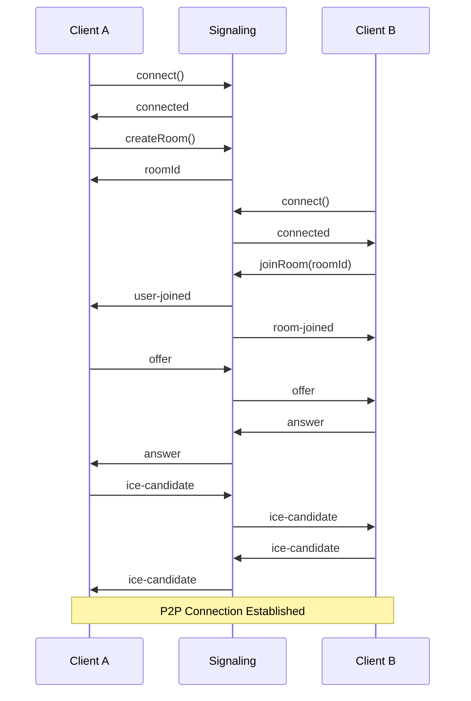

# Architecture Documentation

## Overview

Vibe is a modern WebRTC video chat application built with a modular monorepo architecture using pnpm workspaces. The system is designed for real-time peer-to-peer communication with a scalable signaling infrastructure and reusable component library.

## System Architecture

### High-Level Architecture

```
┌─────────────────┐     ┌──────────────────┐     ┌─────────────────┐
│                 │     │                  │     │                 │
│   Web Client    │────▶│ Signaling Server │────▶│  STUN/TURN     │
│   (Next.js)     │◀────│  (Express/WS)    │     │   (Future)      │
│                 │     │                  │     │                 │
└─────────────────┘     └──────────────────┘     └─────────────────┘
         │                                                 │
         │                                                 │
         └────────────── WebRTC P2P Connection ───────────┘
```

### Monorepo Structure

```
vibe/
├── apps/                    # Application packages
│   ├── web/                # Next.js web application
│   └── signaling/          # Express.js signaling server
├── packages/               # Shared packages
│   ├── core/              # Core business logic and types
│   ├── api/               # API client and server utilities
│   └── components/        # Shared React components
└── infrastructure/        # Docker, Caddy configs
```

## Package Architecture

### 1. Core Package (`@vibe/core`)

**Purpose:** Shared business logic, types, and utilities

**Key Exports:**
- **Types:** `Participant`, `Room`, `SignalingMessage`, WebRTC types
- **Utilities:** ID generation, validation, error handling
- **Classes:** `ConnectionStateManager`, `RoomManager`, `SignalingCore`
- **Constants:** Error codes, limits, configuration

**Dependencies:** None (zero dependency package)

### 2. API Package (`@vibe/api`)

**Purpose:** Client-server communication layer

**Key Exports:**
- **Client:** `SignalingClient` - WebSocket client with event emitter
- **Server:** REST route handlers, middleware
- **Types:** API request/response types

**Dependencies:** `@vibe/core`

### 3. Components Package (`@vibe/components`)

**Purpose:** Reusable React components and hooks

**Key Exports:**
- **Context:** `WebRTCProvider`, `useWebRTC` - WebRTC state management
- **Hooks:** `useMediaStream`, `useRoomConnection`
- **UI Components:** `VideoPlayer`, `MediaControls`, `ParticipantList`, `ConnectionStatus`

**Dependencies:** `@vibe/core`, `@vibe/api`

### 4. Web Application (`apps/web`)

**Technology Stack:**
- Next.js 15.3 with App Router
- React 19.1 with Server Components
- Chakra UI 3.22 for styling
- TypeScript 5.8

**Architecture:**
```
apps/web/src/
├── app/                    # App Router pages
│   ├── layout.tsx         # Root layout with providers
│   ├── page.tsx           # Landing page
│   └── connect/           # Video chat interface
├── components/            # App-specific components
├── contexts/              # Legacy contexts (migrating to @vibe/components)
└── lib/                   # Utilities
```

**Key Features:**
- Server-side rendering with streaming
- WebRTC peer connections via `@vibe/components`
- Responsive design with Chakra UI
- Real-time updates via Socket.io

### 5. Signaling Server (`apps/signaling`)

**Technology Stack:**
- Express 5.1
- Socket.io 4.8
- TypeScript 5.8
- OpenAPI/Swagger documentation

**Architecture:**
```
apps/signaling/src/
├── index.ts               # Server entry point
├── api-docs.ts           # OpenAPI specification
├── https-config.ts       # TLS configuration
└── __tests__/            # Integration tests
```

**API Endpoints:**
- `GET /health` - Health check
- `POST /api/rooms` - Create room
- `GET /api/rooms/:roomId` - Get room info
- `GET /api-docs` - Swagger UI

**WebSocket Events:**
- `join-room` - Join a room with userId
- `leave-room` - Leave current room
- `offer` - Send WebRTC offer
- `answer` - Send WebRTC answer
- `ice-candidate` - Exchange ICE candidates
- `user-joined` - Broadcast user joined
- `user-left` - Broadcast user left

## Data Flow

### Connection Establishment Flow



### State Management

#### Client-Side State

**WebRTCContext** manages:
- Connection state (NEW, CONNECTING, CONNECTED, FAILED, CLOSED)
- Room information (roomId, participants)
- Peer connections (Map<userId, RTCPeerConnection>)
- Media streams (local and remote)

**React Query** for:
- Server state caching
- Optimistic updates
- Background refetching

#### Server-Side State

**In-Memory Storage:**
- Rooms: `Map<roomId, Room>`
- Participants: `Map<connectionId, Participant>`
- No persistent storage (stateless design)

## Infrastructure

### Docker Architecture

```yaml
services:
  caddy:        # Reverse proxy with HTTP/3
  web:          # Next.js application
  signaling:    # Express signaling server
```

**Features:**
- HTTP/3 (QUIC) support via Caddy
- Automatic HTTPS with Let's Encrypt
- Health checks and monitoring
- Container networking isolation

### Security Architecture

1. **Transport Security**
   - TLS 1.3 for all connections
   - HTTP/3 with 0-RTT support
   - Secure WebSocket (WSS)

2. **CORS Configuration**
   - Strict origin validation
   - Credentials support for cookies
   - Preflight request handling

3. **Input Validation**
   - Type-safe message validation
   - Room ID format verification
   - Rate limiting (planned)

4. **Content Security Policy**
   - Strict CSP headers
   - XSS protection
   - Frame options security

## Scalability Strategy

### Horizontal Scaling

1. **Stateless Signaling Servers**
   - No server affinity required
   - Load balancer compatible
   - Health check endpoints

2. **Redis Adapter (Future)**
   - Socket.io Redis adapter
   - Pub/sub for room events
   - Session persistence

3. **CDN Integration**
   - Static asset caching
   - Edge deployment for web app
   - Global distribution

### Performance Optimizations

1. **Build Optimizations**
   - tsup for fast package builds
   - Turbopack for development
   - Tree shaking and minification

2. **Runtime Optimizations**
   - React Server Components
   - Code splitting
   - Lazy loading

3. **Network Optimizations**
   - HTTP/3 multiplexing
   - WebSocket compression
   - Efficient serialization

## Development Patterns

### Code Organization

1. **Separation of Concerns**
   - Business logic in `@vibe/core`
   - UI components in `@vibe/components`
   - Application logic in apps

2. **Dependency Direction**
   - Apps depend on packages
   - Packages don't depend on apps
   - Core has no dependencies

3. **Type Safety**
   - Shared types in `@vibe/core`
   - Strict TypeScript configuration
   - Runtime validation

### Testing Strategy

1. **Unit Tests**
   - Vitest for all packages
   - Testing Library for React
   - Mock WebRTC APIs

2. **Integration Tests**
   - API endpoint testing
   - WebSocket event testing
   - Component integration

3. **E2E Tests (Planned)**
   - Playwright for browser testing
   - Real WebRTC connections
   - Multi-browser support

## Future Enhancements

### Phase 1: Infrastructure
- [ ] Redis for horizontal scaling
- [ ] Kubernetes deployment
- [ ] Monitoring with OpenTelemetry
- [ ] CI/CD with GitHub Actions

### Phase 2: Features
- [ ] TURN server integration
- [ ] Screen sharing support
- [ ] Chat functionality
- [ ] Recording capabilities

### Phase 3: Advanced
- [ ] Media server for large rooms
- [ ] AI-powered features
- [ ] Virtual backgrounds
- [ ] Breakout rooms

## Technology Decisions

### Why Monorepo?
- **Code Sharing:** Shared types and utilities
- **Atomic Changes:** Update everything together
- **Better Refactoring:** Move code between packages
- **Single Version:** Consistent dependencies

### Why pnpm?
- **Disk Efficiency:** Hard links save space
- **Speed:** Faster than npm/yarn
- **Strict:** No phantom dependencies
- **Workspaces:** First-class monorepo support

### Why TypeScript?
- **Type Safety:** Catch errors at compile time
- **IDE Support:** Better autocomplete
- **Documentation:** Types serve as docs
- **Refactoring:** Confident code changes

### Why Next.js 15?
- **Performance:** Server Components
- **Developer Experience:** Fast refresh
- **Production Ready:** Built-in optimizations
- **Full Stack:** API routes included